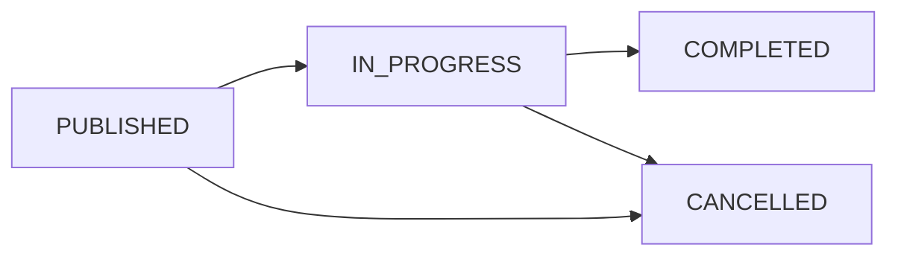

# 🎪 EventHub - Comprehensive Event Management Platform

[](https://github.com/your-username/EventHub-BE/actions/workflows/ci.yml)
[](https://openjdk.java.net/projects/jdk/17/)
[](https://spring.io/projects/spring-boot)
[](https://www.mysql.com/)

EventHub is a modern, full-featured event management platform built with Spring Boot 3.4.4 and Java 17. It provides comprehensive functionality for event organizers and attendees, including real-time notifications, payment processing, analytics dashboards, and automated event lifecycle management.

## 🌟 Key Features

### 🎯 Core Event Management
- **Multi-type Event Support**: Conferences, workshops, seminars, concerts, movies, sports, social events, and more
- **Dual Ticket Tiers**: General admission and VIP tickets with independent pricing and capacity management
- **Event Lifecycle Automation**: Automatic status transitions (Published → In Progress → Completed)
- **Smart Capacity Management**: Real-time ticket availability tracking with automatic updates

### 👥 User Management & Security
- **Role-Based Access Control**: Three distinct roles (Attendee, Organizer, Admin)
- **Spring Security Integration**: Secure authentication and authorization
- **Profile Management**: Complete user profile functionality with secure password updates
- **6-Digit ID System**: Unique, human-readable identifiers for all entities

### 💳 Advanced Payment System
- **Secure Payment Processing**: Complete payment workflow with transaction tracking
- **Comprehensive Refund Management**:
  - Organizer-initiated refunds
  - Attendee refund requests
  - Automated refunds on event cancellation
  - Multi-status refund tracking (Requested, Approved, Rejected, Completed)
- **Financial Security**: Card information protection with last-four-digit storage only

### 📊 Real-Time Analytics & Reporting
- **Live Dashboard Metrics**: Revenue tracking, ticket sales, refund statistics
- **Multi-dimensional Analytics**:
  - Organizer-level insights across all events
  - Event-specific detailed analytics
  - Revenue breakdown by ticket type (General vs VIP)
  - Time-series sales data
- **WebSocket-Powered Updates**: Real-time data streaming every 5 seconds

### 🔔 Intelligent Notification System
- **Real-Time WebSocket Notifications**: Instant updates via `/topic/notifications/{userId}`
- **Automated Event Reminders**: Scheduled notifications for registered attendees
- **Event Lifecycle Alerts**: Cancellation notices, refund confirmations, status updates
- **Persistent Notification History**: Full audit trail with read/unread status

### 🌐 Real-Time Event Broadcasting
- **Live Event Updates**: WebSocket channels for different event states
  - `/topic/events/published` - New events
  - `/topic/events/inprogress` - Currently running events
  - `/topic/events/completed` - Finished events
  - `/topic/events/cancelled` - Cancelled events
- **Dynamic Status Management**: Automated transitions based on event timing

## 🏗️ Technical Architecture

### Technology Stack
```
Backend Framework: Spring Boot 3.4.4
Language: Java 17
Database: MySQL 8.0
Security: Spring Security 6.x
Real-time: WebSocket with STOMP
Build Tool: Maven
Testing: Spring Boot Test Suite
CI/CD: GitHub Actions
```

### Project Structure
```
src/main/java/com/csci334/EventHub/
├── config/           # Configuration classes
│   ├── SecurityConfig.java      # Security & CORS configuration
│   ├── WebConfig.java           # Web MVC configuration
│   └── WebSocketConfig.java     # WebSocket & STOMP setup
├── controller/       # REST API endpoints
│   ├── EventController.java     # Event CRUD operations
│   ├── UserController.java      # User management
│   ├── AuthController.java      # Authentication
│   ├── RegistrationController.java # Event registration
│   ├── PaymentController.java   # Payment processing
│   ├── NotificationController.java # Notification management
│   └── AnalyticsController.java # Analytics & reporting
├── service/          # Business logic layer
│   ├── EventService.java        # Event lifecycle management
│   ├── UserService.java         # User operations
│   ├── RegistrationService.java # Registration workflow
│   ├── PaymentService.java      # Payment & refund logic
│   ├── NotificationService.java # Real-time notifications
│   └── AnalyticsService.java    # Data analytics & reporting
├── entity/           # JPA entities
│   ├── Event.java               # Core event model
│   ├── User.java                # User model
│   ├── Registration.java        # Event registration
│   ├── Payment.java             # Payment transactions
│   ├── Ticket.java              # Digital tickets
│   ├── Notification.java        # Notification history
│   └── enums/                   # Status enumerations
├── dto/              # Data Transfer Objects
│   ├── analytics/               # Analytics DTOs
│   └── ...                      # Request/Response DTOs
├── repository/       # Data access layer
└── utils/           # Utility classes
```

### Database Schema Overview

The application uses a comprehensive relational database design:

- **Events**: Core event information with automatic 6-digit IDs
- **Users**: Role-based user management with secure authentication
- **Registrations**: Event registration workflow with status tracking
- **Payments**: Secure payment processing with refund capabilities
- **Tickets**: Digital ticket generation and management
- **Notifications**: Persistent notification system with WebSocket integration

## 🚀 Quick Start Guide

### Prerequisites
- **Java 17** or higher
- **Maven 3.6+**
- **MySQL 8.0** running on localhost:3306
- **Git** for version control

### Installation Steps

1. **Clone the repository**
```bash
git clone https://github.com/your-username/EventHub-BE.git
cd EventHub-BE
```

2. **Database Setup**
```sql
CREATE DATABASE eventhub;
CREATE USER 'eventhub_user'@'localhost' IDENTIFIED BY 'your_password';
GRANT ALL PRIVILEGES ON eventhub.* TO 'eventhub_user'@'localhost';
FLUSH PRIVILEGES;
```

3. **Configure Database Connection**
Update `src/main/resources/application.properties`:
```properties
spring.datasource.url=jdbc:mysql://localhost:3306/eventhub?useSSL=false&serverTimezone=UTC&allowPublicKeyRetrieval=true
spring.datasource.username=your_username
spring.datasource.password=your_password
```

4. **Build and Run**
```bash
# Install dependencies and run tests
./mvnw clean test

# Start the application
./mvnw spring-boot:run
```

5. **Verify Installation**
- Application runs on `http://localhost:8080`
- WebSocket endpoint available at `ws://localhost:8080/ws`
- Health check: `GET /api/events` should return an empty array

## 📚 API Documentation

### Authentication Endpoints
```http
POST /api/auth/login        # User authentication
POST /api/auth/signup       # User registration
```

### Event Management
```http
GET    /api/events                    # List all events
GET    /api/events/{id}              # Get event details
GET    /api/events/type/{type}       # Filter by event type
GET    /api/events/organizer/{id}    # Events by organizer
GET    /api/events/upcoming          # Upcoming events
GET    /api/events/search?keyword=   # Search events
POST   /api/events                   # Create new event
PUT    /api/events/{id}              # Update event
DELETE /api/events/{id}              # Delete event
PUT    /api/events/{id}/cancel       # Cancel event with password
```

### Registration & Tickets
```http
GET  /api/registrations/user/{userId}           # User's registrations
GET  /api/registrations/event/{eventId}         # Event registrations
POST /api/registrations                         # Register for event
PUT  /api/registrations/{id}/approve            # Approve registration
PUT  /api/registrations/{id}/reject             # Reject registration
```

### Payment Processing
```http
POST /api/payments/make                          # Process payment
POST /api/payments/{regId}/refund               # Organizer refund
POST /api/payments/{regId}/request-refund       # Request refund
PUT  /api/payments/{regId}/approve-refund       # Approve refund
PUT  /api/payments/{regId}/reject-refund        # Reject refund
```

### Analytics & Reporting
```http
GET /api/analytics/organizers/{id}/overview     # Organizer metrics
GET /api/analytics/organizers/{id}/sales        # Sales data
GET /api/analytics/events/{id}/overview         # Event-specific metrics
GET /api/analytics/events/{id}/sales            # Event sales data
```

### Notifications
```http
GET  /api/notifications/users/{userId}          # User notifications
PUT  /api/notifications/{id}/read               # Mark as read
POST /api/notifications/events/{id}/send-reminders # Send reminders
```

## 🔌 WebSocket Integration

### Connection Setup
```javascript
const socket = new SockJS('http://localhost:8080/ws');
const stompClient = Stomp.over(socket);

stompClient.connect({}, function (frame) {
    // Subscribe to real-time updates
    stompClient.subscribe('/topic/events/published', function (message) {
        const newEvents = JSON.parse(message.body);
        // Handle new event notifications
    });
    
    // Subscribe to personal notifications
    stompClient.subscribe('/topic/notifications/' + userId, function (message) {
        const notification = JSON.parse(message.body);
        // Handle personal notifications
    });
    
    // Subscribe to analytics updates
    stompClient.subscribe('/topic/analytics/' + organizerId, function (message) {
        const analytics = JSON.parse(message.body);
        // Update dashboard in real-time
    });
});
```

### Available WebSocket Channels

#### Event Broadcasting
- `/topic/events/published` - New events
- `/topic/events/inprogress` - Events currently running
- `/topic/events/completed` - Completed events
- `/topic/events/cancelled` - Cancelled events

#### Personal Notifications
- `/topic/notifications/{userId}` - User-specific notifications

#### Analytics Streaming
- `/topic/analytics/{organizerId}` - Real-time organizer metrics
- `/topic/sales/{organizerId}` - Live sales data
- `/topic/analytics/event/{eventId}` - Event-specific analytics

## 🔧 Configuration Guide

### Security Configuration
CORS is configured for frontend integration:
```java
// Allowed origins for development
cfg.setAllowedOrigins(List.of("http://localhost:5173"));
```

### Scheduled Tasks
The application includes automated background processes:
- **Event Status Updates**: Every minute (IN_PROGRESS, COMPLETED)
- **Analytics Broadcasting**: Every 5 seconds
- **Notification Delivery**: Real-time via WebSocket

### Database Configuration
```properties
# JPA/Hibernate Configuration
spring.jpa.hibernate.ddl-auto=update
spring.jpa.show-sql=true
spring.jpa.properties.hibernate.dialect=org.hibernate.dialect.MySQL8Dialect

# Debug logging for services
logging.level.com.csci334.EventHub.service=DEBUG
```

## 🧪 Testing Strategy

### Running Tests
```bash
# Run all tests
./mvnw test

# Run tests with coverage
./mvnw test jacoco:report

# Run specific test class
./mvnw test -Dtest=EventServiceTest
```

### Test Database Setup
Tests use a separate MySQL database:
```properties
# Test configuration
spring.datasource.url=jdbc:mysql://localhost:3306/eventhub_test
spring.datasource.username=root
spring.datasource.password=root
```

## 🚀 CI/CD Pipeline

The project includes a comprehensive GitHub Actions workflow:

### Pipeline Stages
1. **Test Phase**: Automated testing with MySQL service
2. **Build Phase**: Maven compilation and packaging
3. **Artifact Management**: JAR file storage with SHA-based naming

### Workflow Features
- ✅ Multi-branch CI (all branches)
- ✅ Pull request validation
- ✅ MySQL 8.0 service container
- ✅ Maven dependency caching
- ✅ Build artifact retention (30 days)
- ✅ Java 17 with Temurin distribution

### Running CI Locally
```bash
# Simulate CI environment
docker run --name mysql-test -e MYSQL_ROOT_PASSWORD=root -e MYSQL_DATABASE=eventhub_test -p 3306:3306 -d mysql:8.0
export SPRING_DATASOURCE_URL=jdbc:mysql://localhost:3306/eventhub_test
export SPRING_DATASOURCE_USERNAME=root
export SPRING_DATASOURCE_PASSWORD=root
./mvnw clean test
```

## 🎯 Event Lifecycle Management

### Automatic Status Transitions


### Status Update Logic
- **PUBLISHED → IN_PROGRESS**: When current time >= event start time
- **IN_PROGRESS → COMPLETED**: When current time >= event end time
- **Any Status → CANCELLED**: Manual cancellation by organizer

### Cancellation Process
1. **Organizer Authentication**: Password verification required
2. **Automatic Refunds**: All paid registrations receive automatic refunds
3. **Notification Broadcast**: All attendees notified via WebSocket
4. **Status Updates**: Registrations and tickets marked accordingly
5. **Capacity Restoration**: Ticket availability restored

## 📊 Advanced Analytics Features

### Real-Time Metrics
The analytics system provides comprehensive insights:

#### Organizer Dashboard
- **Financial Overview**: Total revenue, refunds, net income
- **Event Portfolio**: Total events, upcoming, cancelled counts
- **Ticket Analytics**: Sales by type (General vs VIP)
- **Performance Trends**: Time-series sales data

#### Event-Specific Analytics
- **Revenue Tracking**: Real-time income monitoring
- **Attendance Management**: Registration status breakdown
- **Capacity Utilization**: Ticket availability tracking
- **Refund Analytics**: Refund rate and reasons

### Data Broadcasting
Analytics data is automatically broadcast every 5 seconds to subscribed clients, enabling real-time dashboard updates without manual refresh.

## 🔐 Security Implementation

### Authentication & Authorization
- **Spring Security 6.x**: Modern security framework
- **BCrypt Password Encoding**: Secure password storage
- **Role-Based Access**: Three-tier permission system
- **CORS Configuration**: Frontend integration support

### Data Protection
- **Input Validation**: Comprehensive DTO validation
- **SQL Injection Prevention**: JPA/Hibernate parameterized queries
- **Sensitive Data Handling**: Secure storage of payment information
- **Password Verification**: Event cancellation requires organizer password

## 📈 Performance Optimization

### Database Optimization
- **Lazy Loading**: Efficient entity relationship loading
- **Indexed Queries**: Optimized database queries
- **Connection Pooling**: Efficient database connection management
- **Transaction Management**: Proper transaction boundaries

### Caching Strategy
- **Maven Dependency Caching**: CI/CD optimization
- **JPA Second-Level Cache**: Entity caching for performance
- **WebSocket Connection Reuse**: Efficient real-time communication

## 🤝 Contributing

### Development Workflow
1. Fork the repository
2. Create a feature branch (`git checkout -b feature/amazing-feature`)
3. Commit your changes (`git commit -m 'Add amazing feature'`)
4. Push to the branch (`git push origin feature/amazing-feature`)
5. Open a Pull Request

### Code Standards
- **Java 17 Features**: Use modern Java syntax and features
- **Spring Boot Best Practices**: Follow Spring conventions
- **Lombok Integration**: Reduce boilerplate code
- **Comprehensive Testing**: Maintain test coverage
- **API Documentation**: Document all endpoints

### Pull Request Requirements
- ✅ All tests pass
- ✅ Code follows project conventions
- ✅ Documentation updated if needed
- ✅ No security vulnerabilities introduced

## 📄 License

This project is licensed under the MIT License - see the [LICENSE](LICENSE) file for details.

## 🙏 Acknowledgments

- **Spring Boot Team**: For the excellent framework
- **MySQL Community**: For the robust database system
- **Lombok Project**: For reducing Java boilerplate
- **GitHub Actions**: For seamless CI/CD integration

## 📞 Support & Contact

For questions, issues, or contributions:
- **GitHub Issues**: [Create an issue](https://github.com/your-username/EventHub-BE/issues)
- **Documentation**: This README and inline code comments
- **Community**: Join discussions in GitHub Discussions

---

**EventHub** - Making event management simple, secure, and scalable. 🎪✨